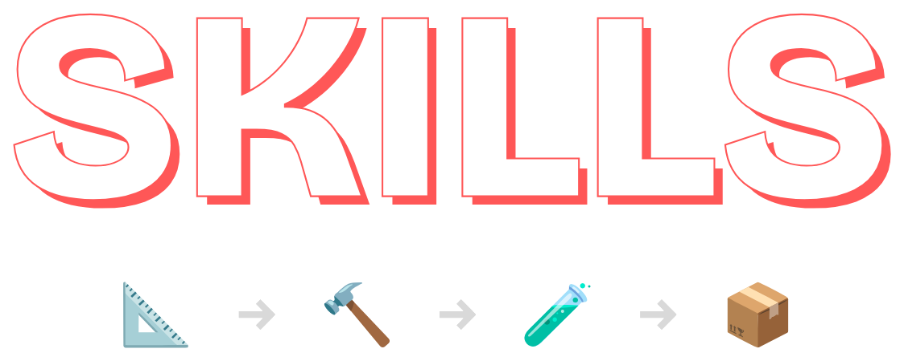
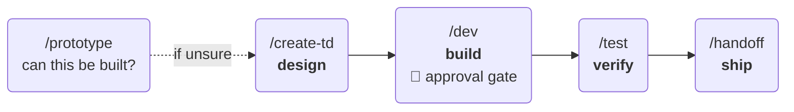

<div align="center">

<h1></h1>

**Five skills that stop your Claude Code sessions from forgetting what you asked for.**

Each stage of a feature gets its own clean context and hands the next one a file — not a scrollback.

[](LICENSE)
[](https://claude.com/claude-code)
[](#-good-to-know)

</div>

---



<div align="center"><sub><b>↑</b> <code>/dev</code> stops for your approval before it writes a single line of code.</sub></div>

## ✅ Before you start

| | What | Why |
|:--:|---|---|
| **Required** | [Claude Code](https://claude.com/claude-code) | These are Claude Code skills. CLI, desktop, web, or IDE extension — any of them. |
| **Required** | A **git repo** | `/handoff` commits and `/prototype` branches. `/create-td` and `/test` work fine without one. |
| **Required** | **bash** to run the installer | Native on macOS and Linux; on Windows use WSL or Git Bash. Or skip it and copy the folders by hand. |
| Recommended | A **`CLAUDE.md`** or **`PRODUCT.md`** | `/create-td` and `/test` read it as your project's source of truth. Without one, `/test` has to ask you what the feature is *supposed* to do. |
| Optional | **[`gh`](https://cli.github.com)** (GitHub CLI) | Lets `/create-td` read a linked issue and `/handoff` open the PR for you. Both work without it. |

**No language or runtime requirements.** The skills detect whatever your project already uses — test
runner, package manager, commit conventions — and follow it. Nothing to configure.

> ℹ️ `/dev` parallelises independent tasks across **subagents**, using **git worktrees** when they'd
> otherwise collide. Both ship with Claude Code and git; there's nothing extra to install.

## ⚡ Install

```bash
git clone https://github.com/TheRealMentor/skills.git shipping-skills
cd shipping-skills && ./install.sh
```

Start a new Claude Code session, then type `/create-td`. That's it.

<details>
<summary>Other ways to install</summary>

<br>

**Want editable copies instead of symlinks?**

```bash
./install.sh --copy
```

By default the installer symlinks, so `git pull` here updates your install. `--copy` gives you files
you can freely edit in place.

**Prefer to do it by hand?** There's nothing magic in the script:

```bash
cp -R skills/* ~/.claude/skills/
cp agents/* ~/.claude/agents/
```

Either way it's idempotent, and it will never overwrite a skill you already had by that name.

</details>

## 🤔 Why

Three hours into one long chat, the agent starts forgetting requirements, re-deciding settled
questions, and tripping over its own stale context.

That's not really a model limitation — it's a context management one. And it's the same mistake as
cramming an entire program into one giant function. So split it by responsibility.

> **Artifacts over memory** — specs belong in files. Any agent can read a file in a fresh context; a
> fact mentioned 40 messages ago is gone.
>
> **Narrow context beats large context** — an agent holding one feature's design outperforms one
> holding your entire repo history. Relevance beats volume.
>
> **Checkpoints where they're cheap** — review a task breakdown *before* code exists, not a diff
> afterwards. Same mistake, two orders of magnitude difference in cost.

## 🛠 The five skills

| | Skill | What it does | Writes |
|:--:|---|---|---|
| 📐 | **`/create-td`** | Requirements → technical design. Reads your code, writes none of it. | `docs/agent-use/<feature>.md` |
| 🔨 | **`/dev`** | Design → task breakdown → **your approval** → implementation, parallelised | `…/<feature>.tasks.md` + code |
| 🧪 | **`/test`** | Tests written from the spec, read *before* the implementation | test files |
| 📦 | **`/handoff`** | Logical commits + a PR description worth reading | git history + PR body |
| 🔬 | **`/prototype`** | Throwaway branch answering "can this even be built?" | `…/prototypes/<slug>.md` |

Every skill has **one job and one line it won't cross.** That's what makes them predictable:

| Skill | The line it won't cross |
|---|---|
| 📐 `/create-td` | Won't touch source. Not one line. |
| 🔨 `/dev` | Won't write code before you approve the breakdown. |
| 🧪 `/test` | Won't edit a test to make it match buggy code. |
| 📦 `/handoff` | Won't push or open a PR unasked. |
| 🔬 `/prototype` | Won't finish without telling you what production really costs. |

## 🚶 A run through, end to end

<details open>
<summary><b>📐 Design it</b></summary>

```
/create-td add SSO login for enterprise accounts
```

Reads your `CLAUDE.md` and the auth code that exists today, asks the one or two questions that would
genuinely change the design, and writes `docs/agent-use/sso-login.md` — problem, non-goals, contracts,
risks, and acceptance criteria in user-visible terms.

Your source tree is untouched. Check `git status` if you don't believe it.

> 💡 **Read it. It's a page.** Fixing the design here costs you a comment.

</details>

<details open>
<summary><b>🔨 Build it</b></summary>

```
/dev docs/agent-use/sso-login.md
```

Breaks the design into tasks — each with the files it touches, what it depends on, and a command that
proves it works — then **stops and shows you the list.**

> 🛑 **This is the checkpoint that pays for the whole workflow.** A wrong assumption caught here costs
> five minutes. The same one caught after implementation costs a day.

Approve it, and independent tasks fan out to subagents that share contracts but never each other's
internals.

</details>

<details open>
<summary><b>🧪 Verify it</b></summary>

```
/test sso-login
```

Reads the acceptance criteria *before* the implementation — deliberately, so the tests describe what
the feature **should** do rather than what the code **happens** to do.

When the two disagree, it tells you which one it thinks is wrong instead of quietly bending the test.

</details>

<details open>
<summary><b>📦 Ship it</b></summary>

```
/handoff
```

Splits the branch into commits that actually mean something, writes the PR body, and stops before
pushing.

```diff
- fix features and stuff                          (1,604 lines)

+ feat: add billing schema and migrations           (412 lines)
+ feat: implement stripe webhook handler          (1,004 lines)
+ test: cover webhook signature verification        (188 lines)
```

</details>

<details>
<summary><b>🔬 …and when you don't yet know if it's possible</b></summary>

<br>

```
/prototype can we stream model output through our existing SSE layer?
```

Throwaway branch, ugliest possible code, and a mandatory verdict at the end: the answer, everything
that was faked, and an itemised estimate of the gap to production.

> 💡 **A "no" here is the cheapest answer you'll get all week.**

</details>

## 📋 Good to know

<details>
<summary><b>Where the artifacts go</b></summary>

<br>

Everything lands in **`docs/agent-use/`** — agent-owned by convention. You're very welcome to read
and review what's in there, but it stays out of the way of your real docs.

Committing it is usually right (it's how the next session gets context). If you'd rather not, one
line in `.gitignore` covers all of it:

```gitignore
docs/agent-use/
```

</details>

<details>
<summary><b>They're stack-agnostic on purpose</b></summary>

<br>

Nothing here assumes a language, test runner, or framework — the skills detect what your project
already uses and follow it.

If you'd rather they just assume your stack, **edit them.** They're plain Markdown, and that's rather
the point.

</details>

<details>
<summary><b><code>/test</code> and <code>/dev</code> are common words</b></summary>

<br>

Installed at user level, these shadow same-named plugin skills — notably `anthropic-skills:test`.

Rename the directories in `skills/` and re-run the installer if you'd rather keep both.

</details>

<details>
<summary><b>Skills nudge, they don't enforce</b></summary>

<br>

These describe how to work, and a model can still misjudge one.

The human gate in `/dev` and the mandatory verdict in `/prototype` exist precisely because the two
moments most worth checking are worth checking **by a person.**

</details>

---

<div align="center">

Built from **[Agentic Workflow for Shipping Code](https://chaiilabs.com/blog/agentic-workflow-for-shipping-code)**,
which makes the argument these skills implement.

MIT licensed — fork it and make it yours.

</div>
